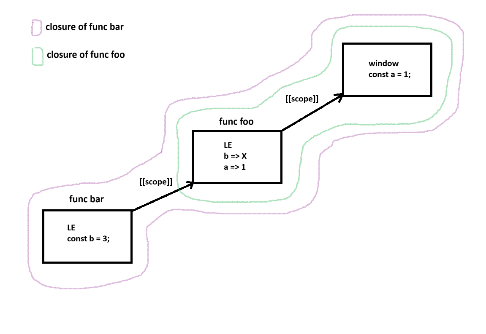

# Функция и из чего она состоит

**Функция** - именованный, автономный блок кода, обладающий локальной областью видимости, предназначенный для выполнения конкретной задачи, который можно многократно вызывать в разных частях программы

У функции есть:
- имя (optional)
- параметры
- возвращаемое значение (по умолчанию undefined)

Функция объявляется с помощью:
- ключевого слова **function**
- конструктора **new Function(params, code)**
- **arrow function** () => {}

# Разница между function declaration и function expression?

- **function declaration** - объявление в потоке кода
    ```ts
    function func (params) {}
    ```
    Создается до выполнения всего кода

- **function expression** - объявление в контексте выражения
    ```ts
    const func = function (params) {}
    ```
    Создается в момент выполнение кода

# Анонимные функции

- Анонимной в JavaScript называют функцию с которой не связано никакое имя

```ts
function ask (question: string, yes: () => void, no: () => void) {
  if (confirm(question)) {
    yes()
  } else {
    no()
  }
}

ask(
  'Do you like cats?',
  function () { alert('Perfect ^_^')}, // анонимная функция
  function () { alert('How dare you!')}
)
```

### IIFE (immediately invoked function expression)

```ts
(function () {
  console.log('I was invoked');
})()
```

# Callback функции

**Callback функция** (функция обратного вызова) - это функция переданная в другую функцию в качестве аргумента, которая затем вызывается по завершении какого-либо действия

```ts
function printName (name: string, callback: () => any) {
  console.log(`Name: ${name}`);
  callback()
}
```

# Рекурсия

**Рекурсия** - вызов функцией самой себя

```ts
let i = 0;

function count () {
  if (i === 3) {
    console.log('I\'m tired')
    return
  }

  console.log(`Counting... ${i}`)
  i++
  count()
}
```

# Каррирование функций

**Каррирование** - процесс создания новой функции путем фиксирования аргументов существующей

```ts
function getMessage(message: string) {
  return function (name) {
    console.log(`Hello, ${name}, we have a message for you: ${message}`)
  }
}

const fireMessage = getMessage('THE BUILDING IS ON FIRE!!!')
fireMessage('Kate'); // 'Hello, Kate, we have a message for you: THE BUILDING IS ON FIRE!!!'
fireMessage('John'); // 'Hello, John, we have a message for you: THE BUILDING IS ON FIRE!!!'
```

# Чистая функция

**Чистая функция** - функция которая всегда при одних и тех же аргументах возвращает одинаковый результат, а также не изменяет ничего снаружи себя

```ts
function clean (a: number, b: number) {
  return a + b;
}

let a = 1;
function dirty (b: number) {
  // Меняет внешнюю переменную
  a = Math.random()

  // Непредсказуемый результат из-за использования Math.random()
  return a + b
}

// dirty
// Меняет внешний объект
function (obj) {
  obj.x = 5
}

// dirty
// Меняет окружение вне функции - выводит в консоль
function () {
  console.log(5)
}
```

# HOC (High order function)

HOC - функция, которая или принимает другие функции как параметер или возвращает функцию

```ts
function calculate (a: number, b: number, callback: (result: number) => any): number {
  const sum = a + b;

  callback(sum);

  return
}

function calculate (a: number, b: number): (operation: 'print' | 'distract', num?: number) => void {
  let res = a + b;

  return function (operation, num = 0) {
    switch (operation) {
      case 'print':
        console.log('SUM: ', res)
        break;
      case 'distract':
        res -= num
        return res;
    }
  } 
}
```

# Замыкание

**Замыкание** - это функция со всеми внешними переменными доступными ей



Все переменные функции - это свойства внутреннего объекта лексического окружения (Lexical Environment), который создается при запуске фунцции. Является скрытым и недоступным для прямого доступа.

Из функции можно обратиться к глобальным переменным, но поиск всегда начинается с собственного лексического окружения, и только затем если ее нет, ищет ее во внешнем объекте.

Сcылка на объект внешнего лексического окружения хранится в специальном внутреннем свойстве функции ``[[scope]]``

```ts
const a = 5;

function foo () {
  const a = 8;
  console.log(a)
}

foo() // 8
```

