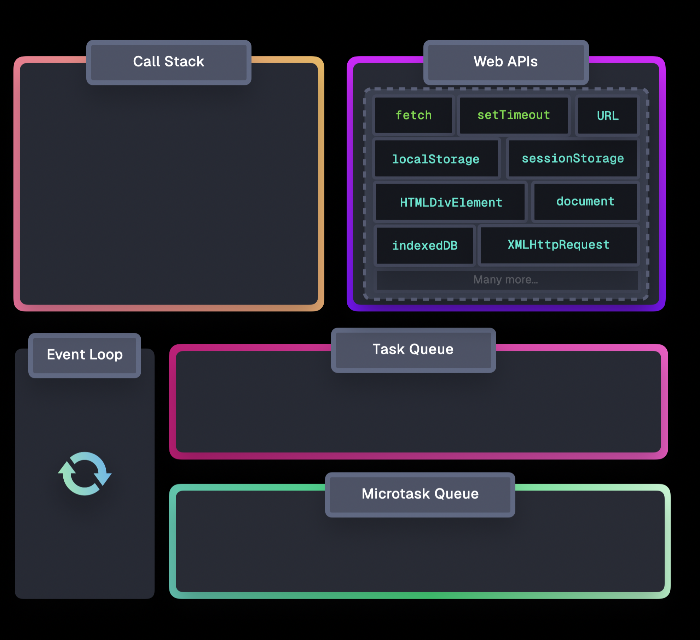

# Разница между синхронными и асинхронными функциями?

Синхронные - выполняются последовательно, блокируя выполнения других функций

```js
function add(a, b) {
  return a + b
}

function multiply(a, b) {
  return a * b
}

add(4,5)
multiply(4,5) // multiply не начнет свое выполнение пока не выполниться add
```

Асинхронные функции - не блокируют поток, позволяя выполнять задачи в фоновом режиме, что повышает отзывчивость приложений

```js
function multiply(a, b) {
  return a * b
}
async function fetchUsers(a, b) {
  try {
    const res = await fetch('https://jsonplaceholder.typicode.com/users')
    return await res.json()
  } catch (e) {
    console.error(e)
    return null
  }
}

fetchUsers().then(data => console.log(data))
console.log(multiply(4,5)) // multiply выполнится даже если fetchUsers не завершится к тому моменту
```

# Что такое AJAX?

AJAX (Asynchronus Javascript And XML) - подход к разработке веб-приложений, позволяющий обновлять части страницы (текст, картинки, данные) без её полной перезагрузки

## AJAX-запрос

1. создаем объект класса XMLHttpRequest
2. Настраиваем запрос
```js
xhr(method, url, flag)
// method
// GET - запрашивает данные
// POST - создает новую запись
// PUT - обновляет ранее созданную запись целиком
// PATCH - обновляет созданную запись частично
// DELETE - удаляет созданную ранее запись
// OPTIONS - проверяет доступные методы запроса на сервере
// flag
// true - default, запрос асинхронный
// false - запрос синхронный (блокирует дальнейшее исполнение кода)
```
3. Отправляем на сервер
4. Отслеживаем завершение запроса

```js
const xhr = new XMLHttpRequest()

xhr.open('GET', 'https://jsonplaceholder.typicode.com/users')

xhr.send()

xhr.onload = () => {} // отслеживает успешное завершение запроса
xhr.onerror = () => {} // отслеживает НЕуспешное завершение запроса
xhr.onloadend = () => {} // отслеживает любое окончание запроса
```

## Плюсы и минусы использовании Ajax?

Плюсы:
- не блокирует код, сохраняя интерактивность
- страница не обновляется полностью
- снижает нагрузку на сервер, так как нет необходимости отдавать весь html целиком

Минусы
- проблемы с SEO так как контент загружается динамически

# Что такое same-origin policy в контексте JavaScript?

Same-origin policy (SOP, Политика одинакового источника) — это фундаментальный механизм безопасности в браузере, который запрещает JavaScript-коду, загруженному с одного домена, взаимодействовать с данными (DOM, куки, запросы) на другом домене.

# Что такое цикл событий (event loop) и как он работает?

Составные части EventLoop

1. движок JS
    - Call stack - исполнение кода
    - memory heap - память для переменных и др.
2. Queue - очередь задач
    - microtasks queue
    - makrotasks queue
3. Web Api - потоки  браузера к которым нет прямого доступа, собственно здесь исполняются асинхронные операции (таймеры, запросы)



# Разница между микро и макрозадачами в event loop?

Очередь микро задач
- приорететнее чем очередь макрозадач
- Туда попадают:
    - .then, .catch, .finally
    - queueMicrotask
    - MutationsObserver

Очередь макрозадач
- Туда попадают:
  - setTimeout, setInterval, setImmediate
  - DOM операции
  - рендеринг страницы

# Расскажите о queueMicrotask?

queueMicrotask - это метод JavaScript, который позволяет запланировать выполнение асинхронной функции (callback) на микрозадачу.

```js
queueMicrotask(() => {
  console.log('Execute microtask');
});
```

# Что такое промисы (Promises)?

Промис (Promise) — это специальный объект в JavaScript, представляющий результат незавершенной, асинхронной операции

Имеет следующие состояния
- pending - находится в процессе выполнения
- fulfilled - выполнен успешно
- rejected - отклонен

Принимает в себя функцию, параметрами которой являются
- функция resolve в результате выполнения которой мы попадем в ветку .then
- функция reject в результате выполнения которой мы попадем в ветку .catch

Содержит следующие методы:
- Promise.resolve(value) - возвращает Promise выполненный с переданным значением
- Promise.reject(value) - возвращает Promise отклоненный с переданным значением
- Promise.all(promisesArr) - возвращает промис, который выполнится тогда, когда будут выполнены все промисы, переданные в виде перечисляемого аргумента, или отклонено любое из переданных промисов.
- Promise.allSettled(promisesArr) - возвращает промис, который исполняется когда все полученные промисы завершены (исполнены или отклонены), содержащий массив результатов исполнения полученных промисов.
- Promise.any(promisesArr) - возвратит единственный объект Promise со значением первого выполненного промиса. 
- Promise.race(promisesArr) - возвратит единственный объект Promise со значением первого завершенного промиса. 
- .then(onFulfilled[, onRejected]) - планирует вызов функции при выполнении промиса
- .catch(onRejected) - планирует вызов функции при отклонении промиса
- .finally(onFinally) - когда промис был выполнен, вне зависимости успешно или с ошибкой, указанная функция будет выполнена

# Подходы при работе с асинхронным кодом?

1. Callbacks - функции которые сработают после завершения события
2. Promises
3. async/await - синтаксический сахар для промисов
4. функции генераторы

# Какие проблемы может вызвать неправильное использование асинхронности в JavaScript?

- Callback Hell  (чрезмерная вложенность асинхронных функций делает код нечитаемым, сложным для поддержки и отладки)
- Гонки данных (Race Conditions): Если несколько асинхронных операций пытаются одновременно изменить одни и те же данные, результат становится непредсказуемым.
- Пропущенные ошибки: Ошибки в асинхронном коде, которые не были правильно обработаны (например, забытый .catch() или отсутствие try/catch в async/await), могут «убить» процесс в Node.js или остаться незамеченными в браузере.
- Утечки памяти (Memory Leaks)
- Проблемы с порядком выполнения: Непонимание работы Event Loop приводит к тому, что код выполняется не в той последовательности, которая ожидается.
- «Забытые» промисы: Вызов асинхронной функции без await или .then(), когда результат ее выполнения критически важен, приводит к логическим ошибкам. 

# Что такое fetch()? Как работает функция fetch()?

fetch() — это современный встроенный метод JavaScript (интерфейс Fetch API), предназначенный для выполнения асинхронных сетевых запросов (получение или отправка данных) без перезагрузки страницы. Он работает на основе Promises

fetch(resource, options)
- resourse - url (string)
- options
    - method - GET, POST, PUT, PATCH, DELETE, OPTIONS
    - body
    - cache
        - no-cache
        - force-cache
    - headers
    - credentials
    - keepalive
    - mode
        - same-origin
        - cors
        - no-cors
    - priority
    - redirect

# Типы таймеров в JS

**Таймеры** - это функции Web API, позволяющие выполнять код с задержкой или периодически. Они планируют выполнение функций в будущем, не блокируя основной поток исполнения.

### setTimeout(func, delay, [arg1, ...])

- func - планируемый к исполнению код
- delay - задержка в мс
- [arg1, ...] - аргументы которые нужно передать в функцию

Отменить исполнение таймера - ``clearTimeout(TimerId)``

``setTimeout`` возвращает рандомный числовой идентификатор ``TimerId``

Рекурсивный ``setTimeout`` - аналог setInterval, но гарантирующий установленную паузу

```ts
let timerId = setTimeout(async function tick() {
  console.log(await Promise.resolve(4))
  clearTimeout(timerId)
  timerId = setTimeout(tick, 2000)
}, 2000)
```

### setInterval(func, interval, [arg1, ...])

- func - планируемый к исполнению код
- interval - интервал исполнения в мс
- [arg1, ...] - аргументы которые нужно передать в функцию

Отменить исполнение таймера - ``clearInterval(TimerId)``

``setInterval`` возвращает рандомный числовой идентификатор ``TimerId``

Не гарантирует точного исполнения интервала выполнения, особенно если функция выполняется дольше заданного интервала

