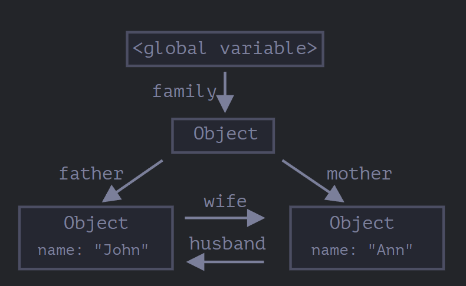
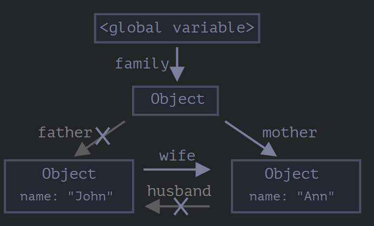
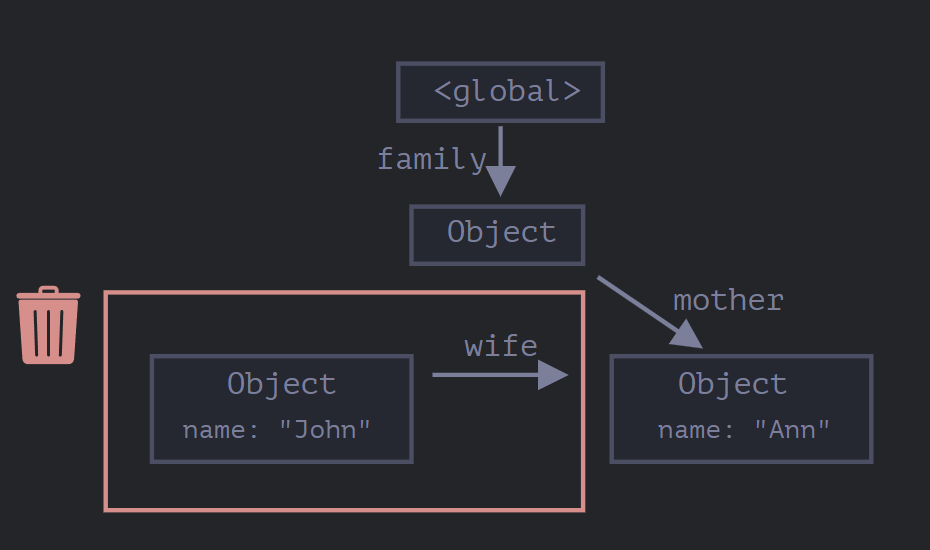
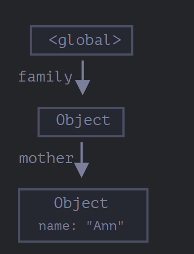

# Какой язык JavaScript

JavaScript - однопоточный неблокирующий интерпретируемый ЯП с неявной слабой динамической типизацией
- **однопоточный** - имеет 1 stack вызовов
- **неблокирующий** - продолжает выполнение кода не ожидая завершения тяжелых ресурсоемких задач (запрос, чтение файла), т.к. передает выполнение среде или браузеру
- **интерпретируемый** - выполняется построчно без предварительной компиляции в машинный код, но в современных версиях движков есть JIT (just in time compilation)
- **неявная** типизация - типы не объявляются явно
- **слабая** типизация - при выполнении операций могут использоваться разные типы одновременно (``'1' + 1``)
- **динамическая** типизация - типы определяются в момент выполнения (runtime)

# Strict mode в JavaScript?

- "use strict" дирректива
- строгий режим исполнения накладывает ряд синтаксических ограничений, и может исполняться иначе
- был добавлен в ES5 для более строгой валидации так как JS обладает обратной совместимость с более ранними версиями
- Какие прошлые неточности убирает режим "use strict" (выдает ошибку):
    - продублированные ключи в объекте
    ```ts
    const user = {
      name: 'Anna',
      age: 20,
      name: 'Jake' // "use strict" не позволит так сделать
    }
    ```
    - переменные без ключевого слова
    ```ts
    plane = 1; // раньше такие переменные просто записывались в window, "use strict" не позволит так сделать
    ```
    - продублированные имена аргументов
    ```ts
    function getMessage (fromWhom, fromWhom) {} // "use strict" не позволит так сделать
    ```
    - фиксация аргументов внутри функции

# Плюсы и минусы использования use strict?

## Плюсы использования "use strict"

- отлавливаем ошибки заранее («тихие» ошибки становятся явными)
- улучшенная оптимизация: Движки JavaScript (V8 и др.) могут быстрее выполнять код, так как он не содержит неоднозначностей, что облегчает работу оптимизирующего компилятора.
- предотвращение случайных глобальных переменных
- безопасность: Запрещает использование синтаксиса, который может быть определен в будущем (например, with, использование eval в опасных контекстах).
- безопасный this: В функциях, вызванных без контекста (not as a method), this становится undefined, а не глобальным объектом window

## Минусы "use strict"

- не совместим со старыми версиями JS (введение режима для них => нерабочий код)
- еобходимость переписывания для старых проектов
- ограничение гибкости: Режим запрещает некоторые «странные» конструкции JS, которые иногда использовались разработчиками ради короткой записи, но делали код непонятным

# Hoisting

**Поднятие (Hoisting)** - механизм, при котором объявления переменных и функций перемещаются в начало области видимости, до фактического выполнения кода. Это позволяет использовать переменные и функции до их объявления в коде.

Поднятию подвержены:
- функции объявленные через FD (function declaration)
- переменные объявленные через var

```ts
console.log(a) // undefined

var a = 5;

sayHello() // 'Hello!'

function sayHello() {
  console.log('Hello!')
}
```

# Что такое выражения (expression) и инструкции (statement) в JavaScript?

Выражения (expressions) в JavaScript — это фрагменты кода, результатом которых является значение (например, 5 + 3, x > 10, true).
```js
// Арифметические
10 + 5;
// Строковые
"Hello " + "World";
// Логические
a > b && c === d;
// Вызовы функций
Math.random(), alert('Hi').
// Объектные/массивы
{name: 'Ivan'}, [1, 2, 3]
```

Инструкции (statements) — это законченные команды, которые выполняют действия, но не всегда возвращают значение напрямую. Например объявление переменных, циклы или условные переходы (например, if, for, let a = 1;).
```js
// Объявление переменных
let a = 5;
// Условные конструкции
if (a > b) { ... }.
// Циклы
for (let i = 0; i < 5; i++) { ... }
// Функциональные инструкции
function myFunc() { ... } (объявление функции)
```

# Что такое мемоизация? Реализуйте базовую логику функции для мемоизации?

Мемоизация — это метод оптимизации, ускоряющий программы за счет кэширования результатов «дорогих» функций

```js
function memo(fn) {
  const cache = {}

  return function (...args) {
    const key = JSON.stringify(args)

    if (key in cache) {
      console.log('Cached data')
      return cache[key]
    }

    const result = fn(...args)

    cache[key] = result

    return result
  }
}

const slowSquare = (n) => {
  return n * n;
};

const memoized = memo(slowSquare)

console.log(memoizedSquare(5)); // 25
console.log(memoizedSquare(5)); // Cached data: 25
console.log(memoizedSquare(10)); // 100
```

# Каким образом можно обмениваться кодом между файлами?

Обмен кодом между JS-файлами осуществляется через модульную систему

1. ES-модули (ES6+), динамический импорт import()
    - Для использования ES-модулей в HTML тег <script> должен иметь атрибут type="module".
2. CommonJS (Node.js): Традиционный метод для серверной части.
    - Node.js по умолчанию использует CommonJS, но может работать с ES-модулями через расширение .mjs или "type": "module" в package.json.
3. Подключение нескольких скриптов через HTML (Браузер):

# Как работает контекст выполнения (execution context) в JavaScript?

Контекст выполнения (Execution Context, EC) в JavaScript — это абстрактное окружение, в котором оценивается и выполняется код. Он содержит метаинформацию: переменные, функции, область видимости и значение this.

Основные аспекты работы контекста выполнения:
- **Глобальный контекст выполнения (GEC)**: Создается по умолчанию при загрузке скрипта. В браузере это объект window, в Node.js — global.
- **Контекст выполнения функции (FEC)**: Создается каждый раз при вызове функции. У каждой функции свой собственный контекст.
- **Стек вызовов (Call Stack)**: LIFO-структура. Функция вызывается -> EC добавляется в стек. Функция завершается -> EC удаляется, передавая управление предыдущему. 

Фазы создания контекста выполнения:
1. Фаза создания (Creation Phase): Движок создает лексическое окружение, сканирует код, поднимает (hoisting) переменные (var инициализируется undefined, let/const — не инициализируются) и функции, а также определяет значение this.
2. Фаза выполнения (Execution Phase): Движок построчно выполняет код, присваивая значения переменным и вызывая функции. 

Компоненты контекста:
- Lexical Environment (Лексическое окружение)
- Variable Environment (Окружение переменных): Место хранения переменных, объявленных через var.
- this binding: Определение значения ключевого слова this. 

# Зачем нужен конструктор Proxy?

Объект Proxy «оборачивается» вокруг другого объекта и может перехватывать (и, при желании, самостоятельно обрабатывать) разные действия с ним, например чтение/запись свойств и другие.

```js
let proxy = new Proxy(target, handler);
```

- **target** – это объект, для которого нужно сделать прокси
- **handler** – конфигурация прокси: объект с «ловушками» («traps»): методами, которые перехватывают разные операции, например, ловушка get – для чтения свойства из target, ловушка set – для записи свойства в target и так далее.

При операциях над proxy, если в handler имеется соответствующая «ловушка», то она срабатывает, и прокси имеет возможность по-своему обработать её, иначе операция будет совершена над оригинальным объектом target.

Список методов ловушек:
| Внутренний метод | Ловушка | Что вызывает |
[[Get]] | get | чтение свойства |
[[Set]] | set | запись свойства |
[[HasProperty]] | has	| оператор in |
[[Delete]] | deleteProperty | оператор delete |
[[Call]] | apply | вызов функции |
[[Construct]] | construct | оператор new |
[[GetPrototypeOf]] | getPrototypeOf | Object.getPrototypeOf |
[[SetPrototypeOf]] | setPrototypeOf | Object.setPrototypeOf |
[[IsExtensible]] | isExtensible | Object.isExtensible |
[[PreventExtensions]] | preventExtensions | Object.preventExtensions |
[[DefineOwnProperty]] | defineProperty | Object.defineProperty, Object.defineProperties |
[[GetOwnProperty]] | getOwnPropertyDescriptor | Object.getOwnPropertyDescriptor, for..in, Object.keys/values/entries |
[[OwnPropertyKeys]] | ownKeys | Object.getOwnPropertyNames, Object.getOwnPropertySymbols, for..in, Object.keys/values/entries |

## Инварианты

JavaScript налагает некоторые условия (инварианты) на реализацию внутренних методов и ловушек.

Большинство из них касаются возвращаемых значений, например метод [[Set]] должен возвращать true, если значение было успешно записано, иначе false.

Применение ловушки get (реализация «значения по умолчанию»)
```js
let numbers = [0, 1, 2];

// прокси перезаписывает переменную
numbers = new Proxy(numbers, {
  get(target, prop) {
    if (prop in target) {
      return target[prop];
    } else {
      return 0; // значение по умолчанию
    }
  }
});

console.log( numbers[1] ); // 1
console.log( numbers[123] ); // 0 (нет такого элемента)
```

Валидация с ловушкой «set» (например, нужно сделать массив исключительно для чисел, если в него добавляется значение иного типа, то это должно приводить к ошибке)
```js
let numbers = [];

numbers = new Proxy(numbers, { // (*)
  set(target, prop, val) { // для перехвата записи свойства
    if (typeof val == 'number') {
      target[prop] = val;
      return true;
    } else {
      return false;
    }
  }
});

// встроенная функциональность массива по-прежнему работает
// pначения добавляются методом push
numbers.push(1); // добавилось успешно
numbers.push(2); // добавилось успешно
console.log("Длина: " + numbers.length); // 2

numbers.push("тест"); // TypeError (ловушка set на прокси вернула false)
```

Подробнее про другие ловушки - [читать здесь](https://learn.javascript.ru/proxy)

# Что такое и как работает debounce() и throttle() в JavaScript?

debounce и throttle — это техники оптимизации производительности в JS, ограничивающие частоту вызова функций. 

Debounce откладывает выполнение до тех пор, пока события не прекратятся (ждет паузу), а Throttle гарантирует выполнение функции не чаще, чем раз в заданный интервал времени, равномерно распределяя вызовы. 

## Debounce()

**Debounce** гарантирует, что функция будет вызвана только после того, как поток событий остановится на определённое время (например, 300 мс). Если событие происходит снова до истечения этого времени, таймер сбрасывается. 

Пример: Поиск в поле ввода (запрос отправляется, только когда пользователь перестал печатать).
Аналогия: Лифт. Он ждет 10 секунд после последнего вошедшего. Если кто-то входит, отсчет начинается заново.

```js
javascript
function debounce(func, ms) {
  let timeout;
  return function() {
    clearTimeout(timeout);
    timeout = setTimeout(() => func.apply(this, arguments), ms);
  };
}
```

## Throttle()

**Throttle** ограничивает количество вызовов функции за промежуток времени. Функция вызывается регулярно, с фиксированным интервалом (например, раз в 100 мс), даже если события происходят постоянно. 

Как работает: Запускается таймер. Событие выполняет функцию. Следующее выполнение возможно только через X миллисекунд, независимо от того, сколько раз событие произошло в этом промежутке.
Пример: Обработка скролла (scroll) или изменения размера окна (resize).
Аналогия: Автомат с едой. Вы можете нажимать кнопку хоть 100 раз в секунду, но еда будет выдаваться не чаще одного раза в минуту.

```javascript
function throttle(func, ms) {
  let isThrottled = false;
  return function() {
    if (isThrottled) return;
    func.apply(this, arguments);
    isThrottled = true;
    setTimeout(() => isThrottled = false, ms);
  };
}
```

# Как в JavaScript работают декораторы? Как они могут быть использованы для модификации поведения классов и методов?

Декораторы в JavaScript — это специальные функции-обертки (с синтаксисом @expression), которые динамически изменяют поведение классов, методов или свойств, добавляя новую функциональность, не меняя их исходный код.\

```js
function loggingDecorator(wrapped) {
  return function() {
    console.log('Starting');
    const result = wrapped.apply(this, arguments);
    console.log('Finished');
    return result;
  }
}
```

Как работают и используются декораторы:
- получают три аргумента: target (класс), key (имя метода) и descriptor (дескриптор свойства). Могут оборачивать метод, добавляя логику до или после его выполнения (например, декоратор @log или @readonly).
- Декораторы классов получают один аргумент — конструктор класса. Используются для расширения функциональности класса, добавления новых свойств или методов.

Применение: Декораторы часто используются в фреймворках (например, Angular) для внедрения зависимостей, обработки запросов или изменения поведения без явного переписывания кода

```js
// Сама функция
function readonly(target, name, descriptor) {
  descriptor.writable = false;
  return descriptor;
}

class Example {
  a() {}
  // ее применение
  @readonly
  b() {}
}
```

# Движки JavaScript

**Движки JavaScript** — это программы (виртуальные машины), которые интерпретируют и компилируют код JavaScript в машинный код для исполнения компьютером.

Основные движки JavaScript:
- V8 (используется в Chromium-браузерах (Edge, Opera) и в Node.js. Один из самых быстрых, преобразует JS прямо в машинный код)
- SpiderMonkey (самый первый движок JS, сейчас используется в Mozilla Firefox)
- JavaScriptCore (Nitro) (Safari)
- Chakra (использовался в Internet Explorer и ранних версиях Edge (сейчас Microsoft перешла на V8). 

Как они работают:
1. Парсинг: Движок считывает код и превращает его в абстрактное синтаксическое дерево (AST).
2. Компиляция: Современные движки используют JIT-компиляцию (Just-In-Time) — компилируют код во время выполнения для ускорения.
3. Выполнение: Код выполняется в стеке вызовов, а объекты хранятся в куче (heap). 

Движки также включают сборщик мусора (Garbage Collector) для очистки памяти

# Как работает «сборщик мусора» в JavaScript?

Основной концепцией управления памятью в JavaScript является принцип **достижимости**.

Если упростить, то «достижимые» значения – это те, которые доступны или используются. Они гарантированно находятся в памяти.

Существует базовое множество достижимых значений, которые не могут быть удалены.

- Выполняемая в данный момент функция, её локальные переменные и параметры.
- Другие функции в текущей цепочке вложенных вызовов, их локальные переменные и параметры.
- Глобальные переменные.
- и др. внутренние значения (корни).

Любое другое значение считается достижимым, если **оно доступно из корня по ссылке или по цепочке ссылок**.

В движке JavaScript есть фоновый процесс, который называется сборщиком мусора. Он отслеживает все объекты и удаляет те, которые стали недоступными.

Пример
```js
function marry(man, woman) {
  woman.husband = man;
  man.wife = woman;

  return {
    father: man,
    mother: woman
  }
}

let family = marry({
  name: "John"
}, {
  name: "Ann"
});
```

Схематично ссылки выглядят так:


Теперь удалим следующие ссылки:

```js
delete family.father;
delete family.mother.husband;
```

Схематично ссылки теперь выглядят так:


Теперь у объекта John больше нет входящих ссылок, объект John теперь недостижим и будет удалён из памяти со всеми своими данными, которые также стали недоступны

Схематично этот процесс выглядят так:


После удаления:


## Внутренние алгоритмы

Основной алгоритм сборки мусора называется «алгоритм пометок» (от англ. «mark-and-sweep»).

Согласно этому алгоритму, сборщик мусора регулярно выполняет следующие шаги:

1. Сборщик мусора «помечает» (запоминает) все корневые объекты.
2. Затем он идёт по ним и «помечает» все ссылки из них.
3. Затем он идёт по отмеченным объектам и отмечает их ссылки. Все посещённые объекты запоминаются, чтобы в будущем не посещать один и тот же объект дважды. И так далее, пока не будут посещены все достижимые (из корней) ссылки.
4. Все непомеченные объекты удаляются.

Движки JavaScript применяют множество оптимизаций, чтобы она работала быстрее и не задерживала выполнение кода.

Вот некоторые из оптимизаций:
- Сборка по поколениям (Generational collection) – объекты делятся на два набора: «новые» и «старые». В типичном коде многие объекты имеют короткую жизнь: они появляются, выполняют свою работу и быстро умирают, так что имеет смысл отслеживать новые объекты и, если это так, быстро очищать от них память. Те, которые выживают достаточно долго, становятся «старыми» и проверяются реже.
- Инкрементальная сборка (Incremental collection) – если объектов много, и мы пытаемся обойти и пометить весь набор объектов сразу, это может занять некоторое время и привести к видимым задержкам в выполнении скрипта. Так что движок делит всё множество объектов на части, и далее очищает их одну за другой. Получается несколько небольших сборок мусора вместо одной всеобщей. Это требует дополнительного учёта для отслеживания изменений между частями, но зато получается много крошечных задержек вместо одной большой.
- Сборка в свободное время (Idle-time collection) – чтобы уменьшить возможное влияние на производительность, сборщик мусора старается работать только во время простоя процессора.

# Что такое утечки памяти?

Утечка памяти — это ситуации, когда приложение выделяет память для объектов, которые больше не используются, но сборщик мусора (garbage collector) не может их освободить, так как на них остаются активные ссылки

## Основные типы и причины утечек памяти в JavaScript

1. Случайные глобальные переменные: Создание переменных без ключевых слов (var, let, const), которые присоединяются к объекту window, из-за чего не очищаются.
    ```js
    function foo() { bar = "Я утечка"; }
    ```
    Решение:
    - strict mode
    - всегда let/const
2. Забытые таймеры и колбэки (setInterval/setTimeout): Если таймер ссылается на объекты внутри замыкания, он удерживает их в памяти, пока работает, даже если DOM-элементы удалены.
    ```js
    setInterval(() => {
      console.log("running");
    }, 1000);
    ```
    Решение: очистка с помощью clearTimeout() и clearInterval()
3. Замыкания (Closures): Непреднамеренное удержание переменных во внешней области видимости, когда замыкание ссылается на большой объект, который больше не нужен.
    ```js
    function create() {
      let bigData = new Array(1000000).fill("data");

      return function () {
        console.log("still here");
      };
    }
    ```
    Решение:
    - не захватывать лишние данные
    - обнулять ссылки
4. Ссылки на удаленные DOM-элементы: Сохранение ссылок на DOM-элементы в JS-объектах или массивах после их удаления из структуры документа.
    ```js
    const el = document.getElementById("item");
    document.body.removeChild(el);
    // Ссылка в переменной 'el' всё ещё существует.
    ```
    Решение
    - обнулять ссылки
    - не хранить DOM в глобальных переменных
5. Неудаленные обработчики событий (removeEventListener): Если обработчик события был добавлен, но не удален после удаления элемента, этот элемент и связанные данные остаются в памяти. 
6. Зависшие ссылки (dangling references)
    ```js
    const cart = [];

    function addItem(item) {
      cart.push(item);
    }
    ```
    Решение:
    ```js
    function clearCart() {
      cart.length = 0;
    }
    ```
7. Promises и async утечки (незавершенные fetch)
    ```js
    new Promise(() => {}); // never resolves
    ```

Для поиска и отладки утечек используются инструменты Chrome DevTools (Memory Panel), позволяющие создавать профили кучи (Heap Snapshots)

# Как сгенерировать случайное число в JavaScript?

## Случайное число от 0 до 1:

```javascript
let rand = Math.random(); // Например: 0.123456789
```

## Случайное целое число от min до max (включительно):

```javascript
function getRandomInt(min, max) {
  return Math.floor(Math.random() * (max - min + 1)) + min;
}
```

## Случайное число с плавающей запятой в диапазоне:

```javascript
let rand = Math.random() * (max - min) + min;
```